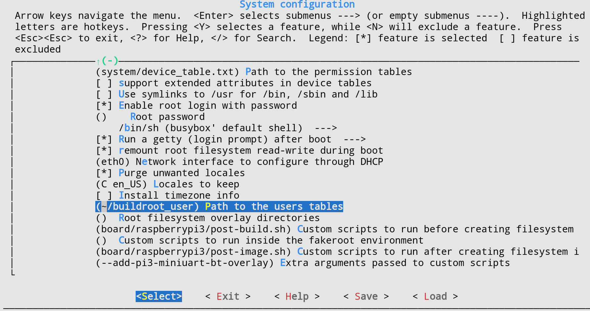

# AKTpi - your own RPi audio distro

**2017/05/02 - Konrad Krenzlin, Manuel Weber**

**coursework for "Klangsynthese" by Henrik von Coler @ TU Berlin**

*[Repository at github](https://github.com/krenzlin/AKTpi)*

**Disclaimer: This tutorial is based on the *2017.02.x* branch of buildroot. Things might be differen for other version.**

This is a basic tutorial on how to roll a Linux system for your own audio projects using buildroot.

Content

0. [Introduction](#introduction)
1. [Getting started with buildroot](#getting-started-with-buildroot)
2. [Configuring buildroot for Raspberry Pi and audio](#configuring-buildroot-for-raspberry-pi-and-audio)
3. [The first start](#the-first-start)
4. [Audio and MIDI setup](#audio-and-midi-setup)
5. [Compiling your own application](#compiling-your-own-application)
5. [Troubleshooting](#troubleshooting)
 
## Introduction

The aim of this tutorial is to create a dedicated, single-purpose, audio system for the Raspberry Pi ready to be used on on stage.
It covers using buildroot to generate an image for the Raspberry Pi, setting up ALSA, Jack and MIDI and compiling your own applications using the generated cross-compilation toolchain of buildroot.

While buildroot makes things relatively easy you still should have a basic knowledge on how to use git, shell, compilation (e.g. LDFLAGS, CFLAGS) and the Linux kernel.

## Getting started with buildroot 

"Buildroot [...] simplifies and automates the process of building a complete Linux system [...]." [buildroot website](https://buildroot.org/)

Buildroot is a tool that allows to easily create a Linux kernel and root file-system, specialized for embedded computers. 
It helps with

* default configurations for various target platforms, e.g. Raspberry Pi, Beagle Bone
* creating a cross-compilation toolchain
* downloading and compiling sources

As buildroot's philosophy is to avoid complexity, it does not come with a packet manager (e.g. aptitude or pacman).
New packages can be added by creating configuration files in the buildroot system, but you will have to rebuild the whole system.
If you need to change or update your system and packages more frequently and less time consuming, have a look at the [openembedded/yocto project](https://www.yoctoproject.org/)!

### Install buildroot dependencies

Buildroot has some dependencies for creating the cross-compiler toolchain.

> See: [https://buildroot.org/downloads/manual/manual.html#requirement](https://buildroot.org/downloads/manual/manual.html#requirement) 

On Debian or a Debian-based distro like Ubuntu you should be fine with:

    sudo apt-get install build-essential libncurses5-dev

Other system will have different needs.

### Getting buildroot

Download the stable version from the [website](https://buildroot.org/).

Or if you want get the latest version via git

    git clone https://github.com/buildroot/buildroot.git

> Note: Make sure to checkout a stable branch, as the latest version can break things. This is probably the case if you get an error message through the course of this tutorial.

## Configuring buildroot for Raspberry Pi and audio

Buildroot targets a lot of different platforms (e.g. Raspberry Pi, BeagleBone, i386) and provides configuration templates for these.
In this tutorial we target Raspberry Pi 1 and 3. If you are using an other platform you need to adjust the following steps to your needs. 

### Loading target platform specific configurations

To load the Raspberry Pi template (called *defconfig*) use:

**Raspberry Pi A, B, A+, B+**

    make raspberrypi_defconfig

**Raspberry Pi 3**

    make raspberrypi3_defconfig

> For details see: [https://git.busybox.net/buildroot/tree/board/raspberrypi/readme.txt](https://git.busybox.net/buildroot/tree/board/raspberrypi/readme.txt)

### Configuring the system and packages

After making the basic configurations for the target platform, we now can adjust our system to our specific needs.
E.g. add or remove packages, configure kernel and sytem, set passwords or change file systems templates.

Buildroot provides different front-ends to the configuration process (see the official documentation).
We are going to use a ncurse-based menu. 

    make menuconfig

> Note: The basic configuration already includes ALSA, but we want to include a bit more, i.e. jack and MIDI. These decisions are up to you and your needs. 

To install some of the ALSA tools you need to *Enable WCHAR support* in the toolchain.

Next, we are going to add tools for better ALSA and MIDI debugging.

Go to *Target Packages* -> *Audio and video applications* -> *alsa-utils*

There select *alsamixer*, *amidi*, *aseqdump*, *speaker-test*.

In the same *Audio and video applications* menu, you can also select *jack2*

Then go back, exit and say yes to save the new configuration.

### make the image

After you finished your configuration, you are now ready to build your system.

> Note: This step can take *several hours*, as buildroot needs to download and compile all the necessary components of your system. 

    make 2>&1 | tee build.log

Buildroot will then download all the necessary source code and start the compilation process (cross-compilation toolchain, system, packages).
If you want to find out what buildroots actual steps are, use:

    cat build.log | grep ">>>"

> Note: You could just use *make*, but as buildroot prints out a lot of logs it easier to save them to a file for later access.

## The first start

After buildroot is completed, it generates an image file for your SD card. Now is the time to get your SD card and Raspberry Pi ready.

### Transfer image to SD card

You can find the image under *output/images/sdcard.img*.

Like in the provided [README](https://git.busybox.net/buildroot/tree/board/raspberrypi/readme.txt) for the Raspberry Pi defconfig, we use the *dd* command to copy the buildroot image to our SD card.

    sudo dd if=output/images/sdcard.img of=/dev/sd??

> Caution: Make sure to provide the correct device file of your SD card to the *of* parameter.

### First Boot 

Some of the configurations for the Raspberry Pi cannot be done within *buildroot* so make sure to checkout the *config.txt* file under the *boot* partition of your SD card.
Checkout [http://elinux.org/RPiconfig](http://elinux.org/RPiconfig) for further information.

Comment out the *display_overscan*, if you have issues with the display.

    # disable_overscan=1

If you want to use the audio out of the Raspberry Pi, add the following line.

    dtparam=audio=on

> Note: To avoid data corruption after editing files on the SD card, make sure to properly un-mount it.

Now you are ready to put th SD into your Raspberry Pi, connect the HDMI and power cable.
The Raspberry Pi should now boot up in a few seconds and show a login prompt.

### Login and new users

By default *buildroot* adds the user **root** with no password.  

#### Adding custom user accounts

You can add custom user accounts in the buildroot configuration with the *BR2_ROOTFS_USERS_TABLES* setting. 
Go to *System configuration -> Path to the users tables*. 

Add the path to a file containing the users buildroot should add for you. 

The file should have the following syntax:

|---|---|---|---|---|---|---|---|---|
|username|uid|group|gid|password|home|shell|groups|comment| 

For example:

    akt -1 wheel -1 =pw /home/akt /bin/sh - this_is_a_comment

### Logout and shutdown

To logout use *<Ctrl>+D* or

    logout

To shutdown Raspberry:

    halt

> Note: As the system should only read from and not write to the SD card, it is fairly safe to just pull the USB power.

## Audio and MIDI setup

To use the Raspberry for your audio application you first want to setup the audio interface(s) and MIDI controller(s).

### Audio via HDMI or audio jack

> Note: Some of the following commands need superuser privileges. So you either login as *root* or use *sudo*.

To use the the Raspberry Pi's HDMI or audio jack output you first need to load the soundcards kernel module.

    modprobe snd-bcm2835

> Note: Make sure you have the *dtparam=audio=on* line in the *config.txt*.

Use *aplay* to list the found soundcard(s).

    aplay -l

With the following commands you then can switch between the outputs.

*HDMI*

    amixer cset numid=3 2

*audio jack*

    amixer cset numid=3 1

To test the audio use for ALSA:

    speaker-test

Or for Jack:

    jack_simple_client

### USB audio

To use a class-compilant audio interface via USB you need to load the *snd-usb-audio* kernel module.

    modprobe snd-usb-audio

After that your interface should be available in ALSA. Check by using:

    aplay -l

> Note: The *snd-usb-audio* module is also needed for MIDI via USB.

### jackd

If you selected jack2 in the buildroot configuration you can also try to start the jack daemon.

These examples are taken from the seminars jack startup script.

Onboard sound:

    jackd -dalsa -r44100 -p2048 &

Focusrite:

    jackd -dalsa -d hw:USB -p256  -n3 -r44100 &

Renkforce soundcard used in the seminar.

    jackd -dalsa -d hw:Device -p128 -n2 -r44100 &

To test the jack audio use:

    jack_simple_client

### MIDI

To use MIDI via USB you need two kernel modules *snd-seq-midi* and *snd-usb-audio*.

    modprobe snd-seq-midi
    modprobe snd-usb-audio

Then connect your MIDI controller via USB. To list all the available MIDI controllers, use:

    aseqdump -l

You can test your controller with

    aseqdump -p <PORTNUM>

If you turn the knobs or press the keys on your controller, the according MIDI notes or CCs should show up.

### inittab

Instead of systemd or init buildroot uses it simplified version, the */etc/inittab* (see file for further information on how to setup the init scripts)
If you want to automate the startup of your interface and controller or even start your audio application on boot time you can add them here.
An easy way to do this, would be to collect all of the above *modprobe*s and jack startup in a single script and start it from within the *inittab*.

For example add a line like this:

    ::sysinit:/bin/sh /media/audio.sh &

> Note: The *inittab* is processed sequentially. So make sure to run blocking commands like jackd in background (i.e. with &)

In *inittab* you can also deactivate consoles, ttys and other services that are started by default. 

## Compiling your own application

Getting your own applications to run on your system is the final step in this tutorial. This involves

### Manual compilation

As your target system does not come with a development enviroment you cannot compile your applications on the Raspberry Pi itself. 
In the process of creating your system, buildroot generates cross-compiler toolchain that you can use to compile for your Raspberry Pi and your system.

The toolchain (e.g. g++, ar, ...) can be found under *buildroot/output/host/usr/bin* and have an architecture prefix similar to 

    arm-linux-*

To compile the simple program *example.c* with no libraries involved:
    
    buildroot/output/host/usr/bin/arm-linux-g++ example.c -o example

Or if you are using *make*, set the *CXX* variable.

    make CXX=output/host/usr/bin/<name-of-architecture>-gcc

### Running it on the Raspberry Pi

You then can copy the created file *example* onto your SD card, boot up the Raspberry Pi and execute it with 

    ./example

> Note: To copy files to the SD card, you may need superuser privileges. Use *sudo*.

Things get a more complicated if you have dependencies. A command to compile the *sinusoid_example* from the course, would look something like this. Not including copying all the sources of *jackcpp* and *sinusoid* into the folder and editing the paths.

    buildroot/output/host/usr/bin/arm-linux-g++ src/jackaudioio.cpp sinusoid.cpp sinusoid_example.cpp -I./include -lpthread -ljack -o example

> Note: If your application needs libraries or programs that are not available in buildroot yet, you should consider writing a package for them (see [Adding a package](#adding-a-package)).

### Adding a package

> **Warning:** This part is currently (April 2017) broken.

Buildroot allows to integrate your own or available packages into the buildroot configuration options and build the package for you.

[See buildroot documentation](http://free-electrons.com/~thomas/buildroot/manual/html/ch11.html)

#### Generic package

    mkdir package/jackcpp

add *package/jackcpp/Config.in*

    config BR2_PACKAGE_JACKCPP
        bool "jackcpp"
        depends on BR2_PACKAGE_JACK2
        help
            C++ bindings for jack

            http://www.x37v.info/projects/jackcpp/

edit *package/Config.in*

    source "package/jackcpp/Config.in"

edit *package/jackcpp/jackcpp.mk*

    JACKCPP_VERSION = 488554cf57c73a77aeb146a8689c937970e6b1f6
    JACKCPP_SITE = $(call github,x37v,jackcpp,$(JACKCPP_VERSION))
    JACKCPP_INSTALL_STAGING = YES
    JACKCPP_INSTALL_TARGET = NO 

    define JACKCPP_BUILD_CMDS
        $(MAKE) $(TARGET_CONFIGURE_OPTS) -C $(@D) all
    endef

    define JACKCPP_INSTALL_STAGING_CMDS
        $(INSTALL) -D -m 0755 $(@D)/libjackcpp.a $(STAGING_DIR)/usr/lib/libjackcpp.a
        $(INSTALL) -D -m 0644 $(@D)/include/* $(STAGING_DIR)/usr/include
    endef

    $(eval $(generic-package))

## Troubleshooting

The whole process is very complex, so there will be times when nothing works. These are just some ideas and hints that may help you in your process.
Sometimes you just have to bite the bullet and start from scratch. So document everything you did!

### buildroot exits with an error.

* Are you on a stable branch of buildroot?
* Did you add a new package that breaks?
* Try deleting the misbehaving package from *buildroot/output/build*.
* Tried *make clean*?

### Raspberry Pi won't boot.

* Changed the GPU RAM settings?
* SD card corrupt?

### SD card is corrupted or behaves strange

* Use *sync* heavily.
* Always unmount your SD card properly.
* Sometimes you just have to redo the transfer of the image.

## Resources
* [Using *buildroot* for real projects](http://elinux.org/images/2/2a/Using-buildroot-real-project.pdf) (PDF)
* [buildroot manual](https://buildroot.org/downloads/manual/manual.html)
