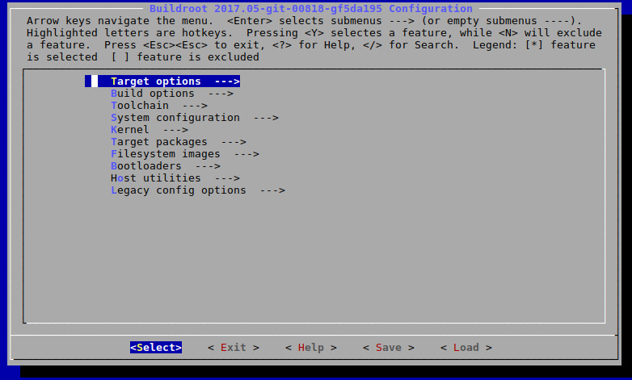
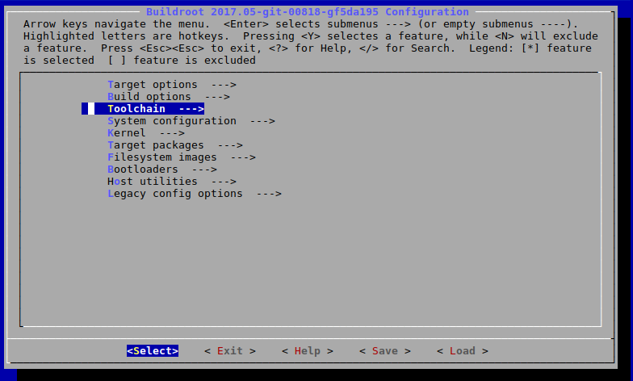
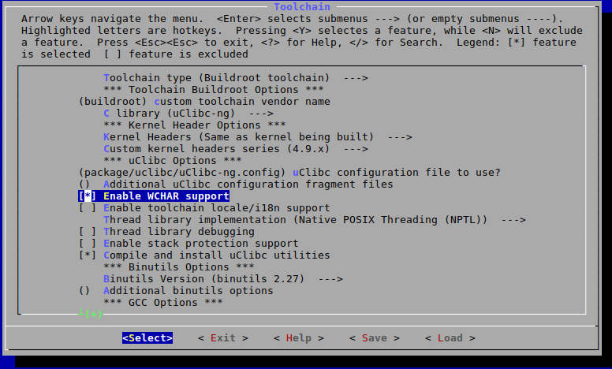
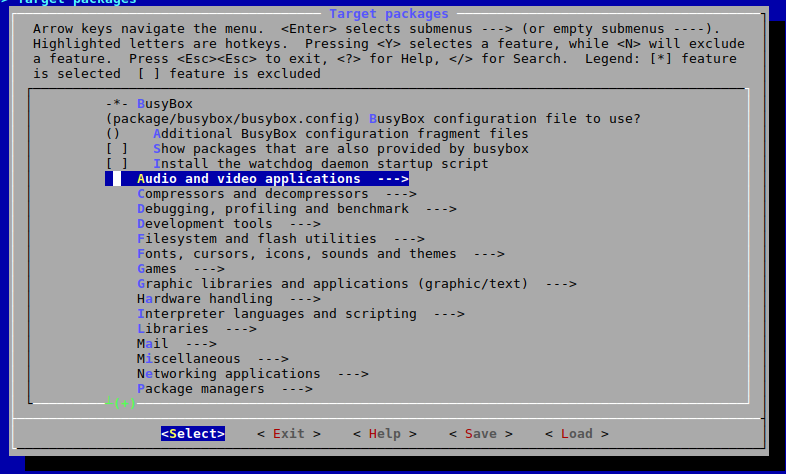
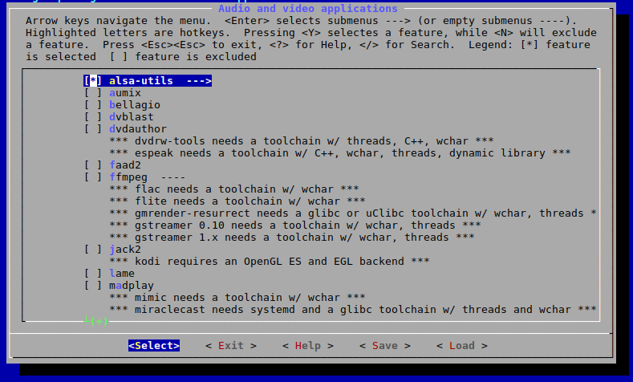
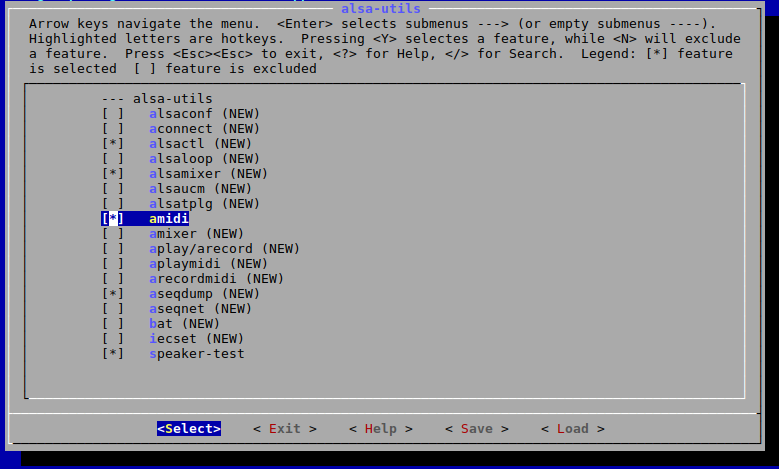
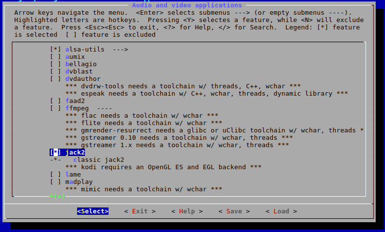
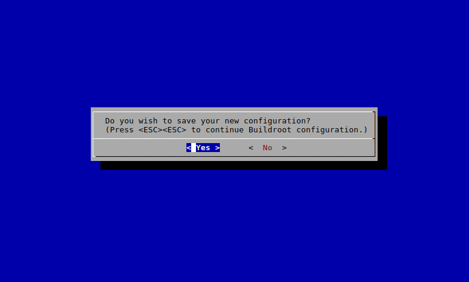

# AKTpi - your own RPi audio distro

This is a basic tutorial on how to roll a dedicated distribution for your own audio projects using buildroot.
Aim: rpi, audio, usb-interface, midi, package (jackcpp)

**Disclaimer: This tutorial is based on the *2017.02.x* branch of buildroot.**

Content
1. [Getting started with buildroot](#getting-started-with-buildroot)
2. [Configuring buildroot for Raspberry Pi and audio](#configuring-buildroot-for-raspberry-pi-and-audio)
 
## Getting started with buildroot 

[buildroot](https://buildroot.org/) TODO buildroot description

### install buildroot dependencies

buildroot has some dependencies for creating the cross-compiler chain.

> See: [https://buildroot.org/downloads/manual/manual.html#requirement](https://buildroot.org/downloads/manual/manual.html#requirement) 

On Debian or a Debian-based Distro like Ubuntu you should be fine with:

    sudo apt-get install build-essential libncurses5-dev

### getting buildroot

Download the stable version from the [website](https://buildroot.org/).

Or if you want get the latest version via git

    git clone https://github.com/buildroot/buildroot.git

> Note: Make sure to checkout a stable branch, as the latest version can break things. This is probably the case if you get an error message through the course of this tutorial.

## Configuring buildroot for Raspberry Pi and audio

buildroot targets a lot of different platforms (e.g. Raspberry Pi, BeagleBone, i386) and provides configuration templates for these.
In this tutorial we target Raspberry Pi 1 and 3. If you are using an other platform you need to adjust the following steps to your needs. 

### Loading target platform specific configurations

To load the Raspberry Pi 1 template (called *defconfig*) use:

    make raspberrypi_defconfig

> For details see: [https://git.busybox.net/buildroot/tree/board/raspberrypi/readme.txt](https://git.busybox.net/buildroot/tree/board/raspberrypi/readme.txt)

### Configuring the system and packages

After making the basic configurations for the target platform, we now can adjust our system to our specific needs.
E.g. add or remove packages, configure kernel and sytem, set passwords or change file systems templates.

buildroot provides different front-ends to the configuration process (see the official documentation).
We are going to use a ncurse-based menu. 

    make menuconfig

> Note: The basic configuration already includes ALSA, but we want to include a bit more, i.e. jack and MIDI. These decisions are up to you and your needs. 

To install some of the ALSA tools you need to *Enable WCHAR support* in the toolchain.

Next, we are going to add tools for better ALSA and MIDI debugging.

Go to *Target Packages* -> *Audio and video applications* -> *alsa-utils*

There select *alsamixer*, *amidi*, *aseqdump*, *speaker-test*.

In the same *Audio and video applications* menu, you can also select *jack2*

Then go back, exit and say yes to save the new configuration.

### make the image

After you finished your configuration, you are now ready to build your system.

> Note: This step can take *several hours*, as buildroot needs to download and compile all the necessary components of your system. 

    make

buildroot will then download all the necessary source code and start the compilation process (cross-compilation toolchain, system, packages).

## The first start

After buildroot is completed, it generates an image file for your SD card. Now is the time to get your SD card and Raspberry Pi ready.

### Transfer image to SD card

You can find the image under *output/images/sdcard.img*.

Like in the provided [README](https://git.busybox.net/buildroot/tree/board/raspberrypi/readme.txt) for the Raspberry Pi defconfig, we use the *dd* command to copy the buildroot image to our SD card.

    sudo dd if=output/images/sdcard.img of=/dev/sd??

> Caution: Make sure to provide the correct device file of your SD card to the *of* parameter.

### First Boot 

Some of the configurations for the Raspberry Pi cannot be done within *buildroot* so make sure to checkout the *config.txt* file under the *boot* partition of your SD card.
Checkout [http://elinux.org/RPiconfig](http://elinux.org/RPiconfig) for further information.

Comment out the *display_overscan*, if you have issues with the display.

    # disable_overscan=1

If you want to use the audio out of the Raspberry Pi, add the following line.

    dtparam=audio=on

> Note: To avoid data corruption after editing files on the SD card, make sure to properly un-mount it.

Now you are ready to put th SD into your Raspberry Pi, connect the HDMI and power cable.
The Raspberry Pi should now boot up in a few seconds and show a login prompt.

By default *buildroot* adds the user **root** with no password.  

> Note: You can change that in the buildroot configuration.

## Setting up the audio system

### Audio via HDMI or audio jack

To use the the Raspberry Pi's HDMI or audio jack output you first need to load the soundcards kernel module.

    modprobe snd-bcm2835

> Note: Make sure you have the *dtparam=audio=on* line in the *config.txt*.

Use *aplay* to list the found soundcard(s).

    aplay -l

With the following commands you then can switch between the outputs.

HDMI

    amixer cset numid=3 2

audio jack

    amixer cset numid=3 1

To test the audio use for ALSA:

    speaker-test

Or for Jack:

    jack_simple_client

### USB audio

To use a class-compilant audio interface via USB you need to load the *snd-usb-audio* kernel module.

    modprobe snd-usb-audio

After that your interface should be available in ALSA.

### MIDI

Connect your MIDI controller via USB. If you previously select *amidi* under *Target packages*, you can use

    amidi -l

to list all the available MIDI controller.

### adjust init

### add jackcpp package

[See buildroot documentation](http://free-electrons.com/~thomas/buildroot/manual/html/ch11.html)

    mkdir package/jackcpp

add *package/jackcpp/Config.in*

    config BR2_PACKAGE_JACKCPP
        bool "jackcpp"
        depends on BR2_PACKAGE_JACK2
        help
            C++ bindings for jack

            http://www.x37v.info/projects/jackcpp/

edit *package/Config.in*

    source "package/jackcpp/Config.in"

edit *package/jackcpp/jackcpp.mk*

    JACKCPP_VERSION = 488554cf57c73a77aeb146a8689c937970e6b1f6
    JACKCPP_SITE = $(call github,x37v,jackcpp,$(JACKCPP_VERSION))
    JACKCPP_INSTALL_STAGING = YES
    JACKCPP_INSTALL_TARGET = NO 

    define JACKCPP_BUILD_CMDS
        $(MAKE) $(TARGET_CONFIGURE_OPTS) -C $(@D) all
    endef

    define JACKCPP_INSTALL_STAGING_CMDS
        $(INSTALL) -D -m 0755 $(@D)/libjackcpp.a $(STAGING_DIR)/usr/lib/libjackcpp.a
        $(INSTALL) -D -m 0644 $(@D)/include/* $(STAGING_DIR)/usr/include
    endef

    $(eval $(generic-package))

### compile tutorial

## Resources
* [Using *buildroot* for real projects](http://elinux.org/images/2/2a/Using-buildroot-real-project.pdf) (PDF)

